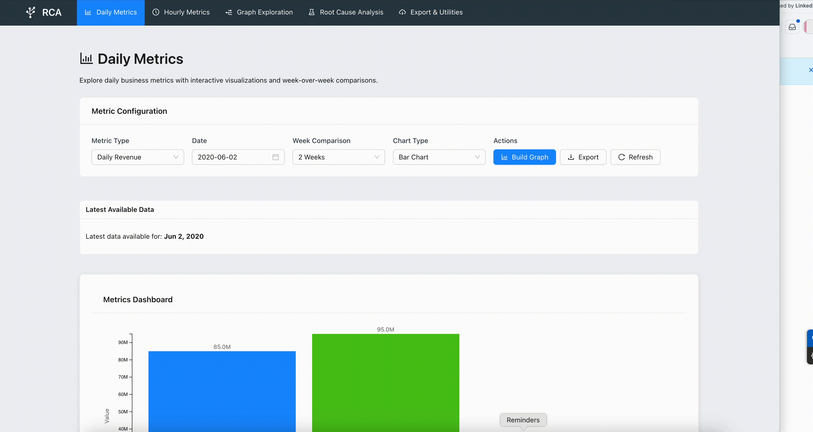

# Root Cause Analysis UI

A comprehensive React-based dashboard for performing root cause analysis (RCA) on business metrics. This application provides powerful visualization tools, automated analysis algorithms, and interactive exploration capabilities to help teams identify and understand the underlying factors contributing to metric changes.

## 🚀 Features
### Demo


### 📊 **Interactive Dashboards**
- **Daily Metrics View**: Analyze daily business metrics with configurable time ranges and week-over-week comparisons
- **Hourly Metrics View**: Time-based analysis of hourly data patterns with peak hour identification
- **Real-time Metric Cards**: Live dashboard showing key performance indicators with trend indicators

### 🔍 **Advanced Analytics**
- **Automated Root Cause Analysis**: AI-powered algorithm that identifies significant factors contributing to metric changes
- **Configurable Analysis Parameters**: Adjustable confidence thresholds, change sensitivity, and result limits
- **Impact Scoring**: Quantitative assessment of each factor's contribution to metric variations
- **Progress Tracking**: Real-time analysis progress with detailed status updates

### 🌳 **Graph Exploration**
- **Interactive Tree Visualization**: Hierarchical tree structure for exploring metric dependencies
- **Force-Directed Graph**: Alternative network visualization with drag-and-drop node positioning
- **Advanced Filtering**: Multi-dimensional filtering by category, status, value ranges, and search terms
- **Node Details Panel**: Comprehensive information display for selected nodes
- **Zoom & Pan Controls**: Smooth navigation with keyboard and mouse controls

### 📈 **Rich Visualizations**
- **Multiple Chart Types**: Bar charts, line charts, and pie charts with interactive elements
- **D3.js Integration**: High-performance, customizable visualizations
- **Click Interactions**: Drill-down capabilities with contextual information
- **Responsive Design**: Optimized for desktop and mobile viewing

### 📤 **Export & Utilities**
- **Multi-Format Export**: Excel (.xlsx), CSV, PDF, and PNG export options
- **Configurable Exports**: Include/exclude charts, summaries, and raw data
- **Export Templates**: Pre-configured export profiles for different use cases
- **Data Processing Utilities**: Validation, compression, and format conversion tools
- **Export History**: Track and manage previous exports

### 🎛️ **Configuration & Controls**
- **Flexible Metric Selection**: Support for various metric types (sessions, revenue, users, etc.)
- **Date Range Pickers**: Intuitive date selection with calendar interface
- **Comparison Periods**: 1-4 week historical comparisons
- **Status Monitoring**: Health indicators with color-coded status system

## 🛠️ Technology Stack

- **Frontend**: React 18 with TypeScript
- **UI Framework**: Ant Design (antd) for consistent, professional interface
- **Styling**: Tailwind CSS for responsive design
- **Visualizations**: D3.js for advanced charting capabilities
- **Routing**: React Router DOM for single-page application navigation
- **HTTP Client**: Axios for API communications
- **Date Handling**: Day.js for date manipulation and formatting
- **Development**: Vite for fast development and building
- **Testing**: Vitest with React Testing Library
- **Mocking**: MSW (Mock Service Worker) for API mocking during development

## 📁 Project Structure

```
src/
├── components/           # React components
│   ├── charts/          # D3.js chart components (Bar, Line, Pie)
│   ├── common/          # Reusable components (MetricCard)
│   ├── ExportUtilities/ # Data export functionality
│   ├── GraphExploration/# Interactive graph visualization
│   ├── HomeView/        # Dashboard homepage
│   ├── HourlyView/      # Hourly metrics analysis
│   ├── Layout/          # Application layout wrapper
│   ├── MetricsView/     # Daily metrics dashboard
│   └── RootCauseAnalysis/ # RCA algorithm interface
├── hooks/               # Custom React hooks
├── services/            # API services and mock data
├── types/               # TypeScript type definitions
├── utils/               # Utility functions and formatters
└── mocks/               # MSW mock handlers
```

## 🚀 Getting Started

### Prerequisites
- Node.js (v16 or higher)
- Yarn or npm package manager

### Installation

1. **Clone the repository**
   ```bash
   git clone <repository-url>
   cd root-cause-analysis-ui
   ```

2. **Install dependencies**
   ```bash
   yarn install
   # or
   npm install
   ```

3. **Start the development server**
   ```bash
   yarn dev
   # or
   npm run dev
   ```

4. **Access the application**
   Open [http://localhost:5173](http://localhost:5173) in your browser

### Available Scripts

- `yarn dev` - Start development server with hot reload
- `yarn build` - Build production-ready application
- `yarn preview` - Preview production build locally
- `yarn test` - Run test suite
- `yarn test:ui` - Run tests with UI interface

## 📖 Usage Guide

### Daily Metrics Analysis
1. Navigate to **Daily Metrics** from the sidebar
2. Configure your metric type, date, and comparison period
3. Click **Build Graph** to generate visualizations
4. Switch between Bar, Line, and Pie chart views
5. Export results using the **Export** button

### Root Cause Analysis
1. Go to **Root Cause Analysis** section
2. Set analysis parameters:
   - Metric type and date
   - Change threshold percentage
   - Minimum confidence level
   - Maximum results to display
3. Click **Run Analysis** to start the algorithm
4. Review results in the interactive table and visualization
5. Export findings for further investigation

### Graph Exploration
1. Access **Tree Structure Explorer** for hierarchical analysis
2. Use the tree navigation panel to explore metric relationships
3. Switch between Tree View and Interactive Graph modes
4. Apply filters by category, status, and value ranges
5. Click nodes to view detailed information
6. Use zoom and pan controls for navigation

### Data Export
1. Visit **Export & Utilities** section
2. Configure export settings:
   - Choose format (Excel, CSV, PDF, PNG)
   - Select data type (Metrics, History, RCA, All)
   - Set date range and options
3. Use export templates for quick configuration
4. Monitor export progress and download files

## 🔧 Configuration

The application supports various configuration options:

- **API Endpoints**: Configure in `src/services/apiConfig.ts`
- **Mock Data**: Customize in `src/services/mockData.ts`
- **Styling**: Modify Tailwind configuration in `tailwind.config.js`
- **Build Settings**: Adjust Vite configuration in `vite.config.ts`

**Built with ❤️ for better root cause analysis and data-driven decision making.**
